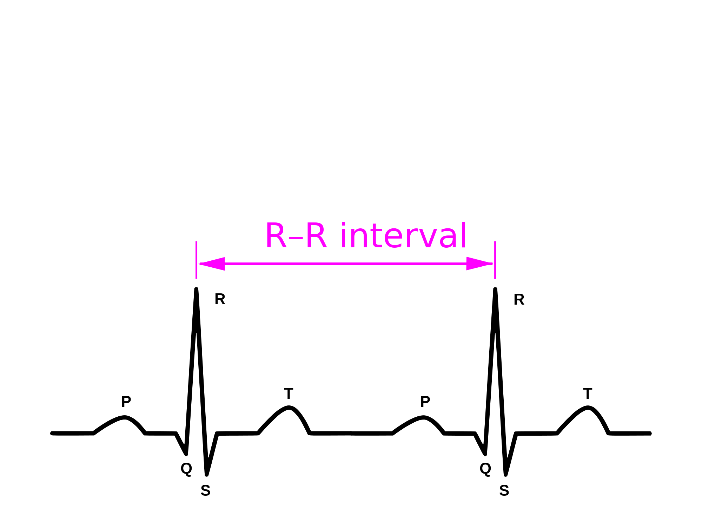
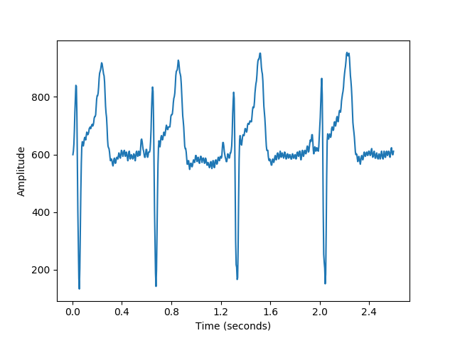

# RPI-Python
Master's project (ME Electronic &amp; Computer Engineering)

**Thesis title**: _IoT Device for Electrocardiography Summary Statistics Monitoring_

**Submitted**: April 2018

**Note**: This readme provides a brief overview of the project. A much more detailed outline is found in the thesis.

## Project Aim:
The aim of this project was to propose and develop a solution to the problems associated with heart monitoring. The focus was on creating a novel solution for electrocardiography to provide preliminary or inital results, giving indidations of underlying cardiac issues so the patient can be referred to a cardiologist. The main consideration was to use low-cost components, which would allow the device to be used in a patient's home as well as in low income countries and regions.

The project focuses on two main objectives:
* The hardware used to capture/store the heart data.
* The softare used to analyse the patient's data, performing signal processing and unconver any underlying abnormalities.

## Motivation:
The motivation behind this project is about introducing a novel solution to the growing problem of cardiovascular (heart) diseases (CVDs). CVDs are the leading cause of mortality in the world, amounting to a total of approximately 17 million deaths globally - or 32% of all moralities. More than 80% are in low to middle-income countries such as parts of Asia, Eastern Europe and North Africa. Clearly, the less wealthy are more at risk because many do not have access to proper healthcare.

The ability to automate the monitoring process could help to reduce cardiovascular disease mortality rate, as well as to reduce the healthcare costs associated.

## Background and Theory:
### Electrocardiography
This project is based heavily on electrocardiography. Electrocardiography (ECG) is one of two main methods of heart monitoring - the other being photoplethysmography (PPG), a light-based monitoring method used by smartphones and fitness wristbands. ECG is used more in medical devices due to its increased accuracy and ability to provide more metrics compared to PPG. 

Electrocardiography (ECG) is the process of measuring the small electrical signals that are a result of the activity of the heart’s muscles, known as biopotentials. It is one of the most basic forms of non-intrusive diagnosis in medicine and is usually performed by placing small electrodes on the surface of a patient’s skin. The electrodes of an ECG machine record these changing biopotentials and the signal is represented in the form of a moving voltage versus time graph. The conventional ECG machine uses as 12-lead setup. Variations of this exist, using 5-lead or even the 3-lead configuration used in this project.

### Electrocardiogram Analysis
A typical ECG signal is represented in the form of a _PQRST_ waveform, where each letter represents a different section of the cardiac cycle. Analysis of this waveform can reveal a lot about a patient's health.
* The P wave is due to the depolarisation of the atria of the heart.
* The QRS complex is a result of the depolarisation of the left and right ventricles. The increased amplitude of the QRS complex is due to the ventricles’ larger muscle mass compared to the atria, therefore producing larger biopotentials.
* The T wave represents the repolarization of the ventricles.

  

The image above shows the general shape of an ECG signal, but is unrealistic due to the absense of noise. In reality, noise exists due to the patient's movement/respiration, power line interference and muscle noise from muscles contracting in close proximity to the heart.

### Heart Rate Variability Analysis
Heart rate and heart rate variability are very different metrics. Heart rate (pulse) simply measures the averate number of beats per minute (BPM) of a patient. Since it is an average, it ignores the variation in intervals between successive beats and is not a great metric for cardiac analysis.

Heart rate variability is an analysis of the beat-to-beat variation. The interval between beats - known as the _RR_
interval or inter-beat interval (IBI) - is measured in milliseconds and these intervals can be analysed to give a good overall indication of a person’s heart health.

The autonomic nervous system contains parasympathetic and sympathetic nerves which affect a human’s heart rate. Without the autonomic regulation, a resting heart rate would be around 100 BPM, known as the intrinsic heart rate. However, the _parasympathetic nervous system_ (PSNS) lowers the resting heart rate to around 70BPM. During intensive exercise, the _sympathetic nervous system_ (SNS) increases the rate rate.

HRV is the analysis of the balance between the PSNS and SNS. A high HRV is an indication of a healthy autonomic nervous system and cardiovascular response, that the heart can effectively change rate depending on the activity level and
indicates a greater cardiovascular fitness and more resilience to stress or disease.
On the contrary, a low HRV indicates the PSNS and SNS are not properly balanced and that the patient is more susceptible to heart attacks, stress, strokes etc.

Various methods of heart rate variability analysis exist, and can mostly be separated into two main categories: time-domain analysis and frequency-domain analysis. Time-domain analysis methods are more commonly used in the medical field
and are based on the beat-to-beat intervals of the ECG signal. In this project, analysis is done purely in the time-domain.

### QRS Detection
The QRS complex is the most promimant feature of the ECG signal due to its high amplitude, and as such, it is the basis of most ECG algorithms. One such QRS detection algorithm is Pan Tompkins algorithm, a series of signal processing techniques for correctly identifying QRS complexes, was developed for devices with very low processing power. The QRS detection algorithm used in this project is based heavily on Pan Tompkins algorithm.

### Internet of Things
One of the key aspects of this project revolves around the Internet of Things (IoT), which is the idea of “anything that can be connected, will be connected”. The IoT has seen billions of new devices connected to the internet in recent years, can be attributed to better networking infrastructure to wirelessly connect devices, the introduction of cloud computing
for easily scaling processing resources and, most notably in the wearable industry is Moore’s Law, which is an observation of the number of transistors on an integrated circuit doubling approximately every two years, resulting in small but powerful
devices. 

The idea of the Internet of Things is used in this project, to allow for remote and continous monitoring over the internet. Cardiac results are uploaded to a private cloud which can be monitored by a physician. 

## Methodology
### Hardware
#### Rasperry Pi
The first consideration for the project was to decide the hardware used to collect and process the ECG data. The main three features required were low cost, low power and small form-factor. The device has to perform a range of different tasks:
* Interface with a seperate 3-lead ECG sensor.
* Sample the ECG signal at an appropriate rate.
* Perform analogue-to-digital conversion of the ECG signal.
* Run an algorithm to perform QRS peak detection of the ECG signal.
* Run an algorithm to perform heart rate variability (HRV) analysis on the ECG signal.
* Upload the results of the analysis to the cloud.

Initially an Arduino Uno - a simple microcomputer with no graphical interface that runs one program continously - was used.
The Arduino was then removed in favour of a Raspberry Pi (although I added functionality to allow Arduinos to gather the data and store it on a PC). The Pi is a general purpose computer that runs a Linux-based operating system that can run several programs simultaneously and provides a graphical interface to the user. The Pi had several significant advantages over the Arduino including higher processing power, a GUI, ability to run many programming languages and much higher storage capacity. The Pi allowed me to write most of the algorithms in Python and use many of the existing Python modules online, rather than writing everything from scratch.

#### Analogue-Digital Converter
The main disadvantage of the Pi is that it does not feature an on-board analogue-digital converter (ADC). A third-party ADC must be used to convert the analogue biopotential signals into digitised values. The MCP3008 ADC was used in this project, due to its low price and easy compatibility with the Pi. The MCP3008 can provide a sampling rate of 200k samples per second, with a 10-bit resolution - meaning the digitised ECG signal will be represented by values in the range 0 to 1023. The ADC uses a reference voltage - 5V for this project - to generate the output digitised value. 5V/1023 means there is a step size of approximately 4.88mV.

Communication between the ADC and the Raspberry Pi is achieved using the _serial peripheral interface_ (SPI) protocol. The SPI protocol is for serial communication in embedded systems, microcontrollers and integrated circtuits. The Raspberry Pi uses GPIO (general purpose in/out) pins for SPI communication. Four pins are used for SPI communication:
* MOSI - Master Out Slave In (data from PI to ADC).
* MISO - Master In Slave Out (data from ADC to PI).
* SCLK - Serial Clock (keep Pi and ADC in synch).
* CE - Chip Enable (used by Pi to select which device to interface with).

#### ECG Sensor
A third-party ECG sensor was used for this project. The low-cost sensor uses a 3-lead configuration to acquire ECG signals. The 3-lead configuration is suitable for this project as I use HRV analysis which only requires a 3-lead signal. The sensor uses an integrated signal-conditioning circuit to amplify ECG signals and remove unwanted noise.

The image above shows the placement of electrodes for the 3-lead sensor. The three limb electrodes - denoted I, II and III - form an Einthoven’s triangle at the right arm (RA), left arm (LA) and left leg (LL). The ECG signal we then see is a combination of these seperate potentials. 
1. Lead I: between the right and left shoulders.
i. _I = LA − RA_
2. Lead II: between the right arm and left leg.
ii. _II = LL − RA_
3. Lead III: between the left shoulder to the left leg.
iii. _III = LL − LA_
  
 
### Software
The majority of the software is written in Python. The main reason for this is that there are a huge amount of modules for interfacing with various modules like the ADC, as well as modules for signal processing and data analysis.

The above image shows the basic program flow. Executing the main file allows the user to choose the sampling rate, the lenght of time to record for, and the mode in which the program will run.
1. Raspberry Pi mode (recording live data and analysing/storing data on the Pi).
2. Arduino mode (recording live data using the Arduino, analysing/storing data on a PC or Pi).
3. Debug mode (feed the program historical data, useful for debugging and experimenting).

The digitised ECG data is stored in a _.csv_ file, which the program reads from after the recording has finished. The filename records the duration of the recording as well as the date and time it was run. Following analysis, the data will be removed or stored if abnomolies are detected.

The data read from the file is scaled to the range 0 to 1023 before any processing or analysis is done. This allows for different ECG sensors/ADCs/datasets to be used - increasing the usefulness of the program. The data is loaded into a pandas dataframe.

#### Pan Tompkins
The Pan Tompkins algorithm is then used on the ECG data for feature classification. The derivative-based PT algorithm is a   series of singal processing steps to detect QRS peaks in the signal. The algorithm recognises QRS complexes based on analysis of the slope, amplitude and width.
Pan Tompkins algorithm was chosen as it very accurate, computationally efficient and well-documented. The algorithm was implemented in Python for this project. PT algorithm starts by filtering out unwanted noise before amplifying the QRS complex. Finally, a decision algorithm is used to denote where a peak is located in the signal. 

The Pan Tompkins algorithm follows the processing steps shown above. 
1. A band-pass filter, in the form of a low-pass cascaded with a high-pass, is used to filter the noisy input data.
2. The signal is then differentiated to identify the large slopes associated with the _QRS_ complexes of a normal ECG signal. This process suppresses the low-frequency components of the ECG signal, while amplifying the high-frequency components. The result is an ECG signal with attenuated _P_ and _T_ waves, with amplified _QRS_ complexes.
3. The squaring operation provides non-linear amplification of the signal. The ECG signal is squared point-by-point, resulting in a signal that is all positive and emphasises the high frequencies found in the _QRS_ complex.
4. A moving average, or rolling mean of the signal is calculated. By choosing an appropriate window size, the aim is to produce a single peak which represents a QRS complex.
5. The moving average signal is used as a threshold for detecting QRS complexes. The algorithm goes though each value in the derivated signal and checks if the amplitude is greater than the moving average signal at that time, which indicates a peak is detected. The position of all detected R-peaks are stored in the results dictionary.

Finally, the RR intervals are calculated using the positions of the detected peaks. The interval is measured by getting the number of samples between each pair of successive identified peaks and converting the interval, measured in samples, into
a time interval measured in milliseconds.

#### Heart Rate Variability Analysis
The result of implementing the Pan Tompkins algorithm is a stream of impulses representing the QRS complexes of the ECG signal. The peaks are annotated and the interval between each peak - known as the _RR_ intervals - are calculated and
stored in a list. Using this data, heart rate variability (HRV) analysis can be performed.

Heart rate variability (HRV) analysis is a collection of various metrics used by cardiologists to better understand a patient's health. For this project, I picked out a selection of the most common statistics calculated with HRV analysis.
* Heart rate (bpm) - an average of the _RR_ intervals by the number of measured beats, in minutes.
* Root mean square of successive differences (RMSSD) - the average interval between successive QRS peaks in the ECG signal.
* Standard deviation of intervals (SDNN) - standard deviation of the normal _NN_ (_RR_) intervals of an ECG signal.
* pNNx - number of times in which the change in successive _NN_ intervals exceeds a certain predefined number of milliseconds, _x_, represented as a percentage of the total intervals.

#### Analysing Results
Once the heart rate variation analysis has been performed, the results are examined. The purpose of this is to uncover any arrhythmias or abnormalities in the data. The results are compared with a list of 'normal' values - a range for each metric for which the average healthy person's data should fall between. The ranges I used are for a 20-29 year-old male (me).

HRV Metric | Normal Range
------------ | ------------
SDNN(ms) | 100-250
SDANN(ms) | 80-240
RMSSD(ms) | 20-90
pNN50(%) | 5-25
Heart Rate(bpm) | 60-100

  
Each metric calculated is tested against the given range, and if there are no abnormalities found, then the data is removed automatically. If the results are found to be abnormal, the original data is stored locally and an indication as to the diagnosis or condition is reported to the user.

#### ThingSpeak
The results of the analysis are sent automatically to the cloud. The cloud solution used for this project is ThingSpeak, an open-source IoT platform for collecting and analysing sensor data. The channel has several fields, one for each of the HRV metrics analysed, and can all be updated simultaneously for visualisation of the patient results. Using a cloud service increases the applications for this project. By having the results upload directly to the cloud automatically, remote monitoring can be performed by the cardiologist.

## Results
For many of the results obtained, an ECG signal generator was used. This generates a synthetic ECG signal at an adjustable rate and was used in the 3-lead configuration. Using this generator allowed me to debug and analyse efficiently, as I knew what the expected outputs should be. 

Since one of the key focuses of the project is the cost-effectiveness, I compiled a pricelist for the main hardware components:

Component | Price (euro)
------------ | ------------
Raspberry Pi | 36.25
ECG Sensor |17.11 
MCP3008 ADC | 3.55
------------ | ------------ 
Total | 59.61

#### Data Collection
During development, the results obtained using the Raspberry Pi and ADC were inconsistent and varied, while using the Arudino to collect data yielded much more accurate and consistent results. I found that this was because the Arduino uses hardware timers and a programming language based on C/C++, while on the Pi I was using Python for sampling the signal. Python uses software timers and the Pi could be performing several tasks at any one time, meaning the processor is being continually interrupted with memory management tasks etc. I rewrote the sampling software for the Raspberry Pi in C, a lower-level programming language, which allowed me to get direct control over the GPIO pins on the Pi. 

The image below shows a segment of an input ECG signal recorded by the Pi, after normalisation.

A number of sampling rates were tested and analysed to determine if they were suitable. The concern here was the trade-off between accuracy and processing time, as well as the file-size for obtained data. Ideally, a very high sampling rate would be used as it would yield the most accurate ECG signal, with a large number of samples to represent the continuous-time ECG signal as a discrete-time signal. 

As seen in the above figure, there is little difference between sampling at 250Hz and 500Hz on the ECG signal. Sampling at 50Hz however provided inconsistent results due to the undefined peak amplitude, as can be seen in the image below. I found that a sampling rate of 200-250Hz provided good results, without a degredation in performance. Pan Tompkins algorithm took approximately 57 seconds to run on an hour of ECG data sampled at 250Hz.

#### ECG Live View
I also created a method of viewing the ECG signal in real-time. Until this point, the device gathers and stores the ECG data in a file, which is then opened and the contents are read by the script. Using the matplotlib.animate class, a live view graph for viewing the ECG data was created. 

#### QRS Detection
I used the signal generator to produce an ECG signal at a constant 60 bpm, and sampled at 200Hz. The following images are the results of the Pan Tompkins algorithm at each stage. In the final stage, the detected _QRS_ peaks are annotated with a red dot for easy visualisation. The amplitude scale at each stage changes due to signal processing techniques, and since HRV analysis is based solely on time intervals, I decided to removed the aplitude scale from the graphs.

#### HRV Analysis
Using the same data obtained as above the intervals between successive peaks, the _RR_ intervals, are calculated. For a fixed input rate of 60 bpm, we would expect the measured intervals to all be 1 second (1000ms). A portion of the measured results are shown below:

IBI | Interval (ms)
------------ | ------------
RR1 | 1005
RR2 | 1000
RR3 | 1000
RR4 | 1005
RR5 | 1000
RR6 | 1000
RR7 | 1000
RR8 | 1005
RR9 | 1000
RR10 | 1000

The results are as expected. Examining the output of the PT algorithm shows a very consistent heartbeat with no false or missed detections. The measured heartrate is 59.9 bpm which is almost indentical to the known input of 60bpm. The other HRV analysis results - _RMSSD_, _SDNN_ and _pNNx_ - were negligable as expected, since HRV is the analysis of the **variation** in heart rate and the data used is for a fixed heart rate.

So, I set up an experiment to gather ECG data from myself. I didn't have all the necessary equipment for a proper reading, so there is room for improvement as can be seen from the PT algorithm output below where there are a few missed or false detected beats, however the results obtained are good.

The HRV analysis results are shown below, and there are no indications of bad cardiovascular health.

Metric | Result
------------ | ------------
Heart Rate (bpm) | 76.33
RMSSD (ms) | 378
SDNN (ms) | 313
pNN50 (%) | 23.68%

#### File Storage & ThingSpeak
The results of HRV analysis are examined and compared against a list of normal results for each metric. As an example, for a measured heart rate of below 40BPM or above 120BPM - an indication of conditions called bradycardia and tachycardia respectively - means that the data is stored locally, with the filename annotated with the date and time the test was performed.

The results of the HRV analysis are uploaded automatically to ThingSpeak after processing has been completed. The ThingSpeak channel has four fields for each of the results in question - heart rate, RMSSD, SDNN and pNN50. The fields have
parameters for adjusting the timescale, to average multiple results from a single period and thresholds to filter out unwanted results.

## Conclusion
I believe that the project was quite successful. I succeeded in using low-cost and 'hobbyist' parts to record ECG data. I wrote an algorithm in Python to perform QRS detection which worked well, as well as code to perform HRV analysis. I increased the potential usefulness of the project by adding features like live-viewing of the signal and cloud storage of results.

Two main viable applications of the project that I have identified are:
* Low Income & Remote Areas: This project could be very beneficial to lower-income or remote areas. Remote areas located far from major hospitals which may not have access to ECG machine, or low-income countries like parts of Africa, Latin America and South-East Asia could benefit greatly from a low-cost approach such as this. The project could provide an initial diagnosis that could uncover health issues so the patient could be referred to a cardiologist.
* Remote Monitoring: By utilising the Internet of Things and the cloud, the possible applications for this project are greatly increased. A physician or cardiologist can use this feature advantageously by performing remote monitoring. The
patient could use the device in his/her own home for an extended period of time and by continuously uploading the analysis results to the cloud, the physician can remotely monitor the patient’s cardiovascular health.

Although there is room for improvement, the key methodology outlines a novel approach to the problem of heart monitoring to tackle the increasing issue of cardiovascular diseases.
